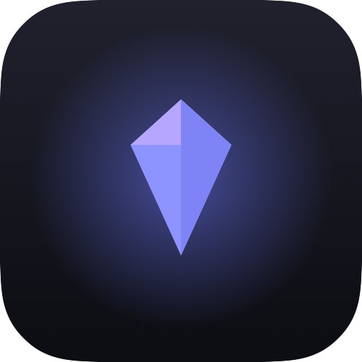
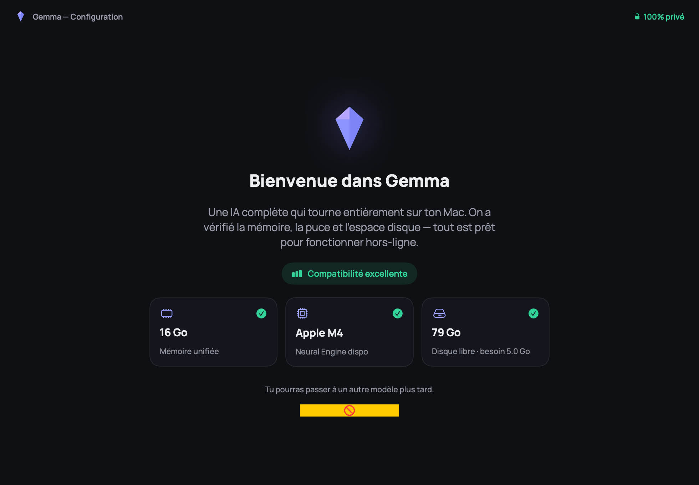
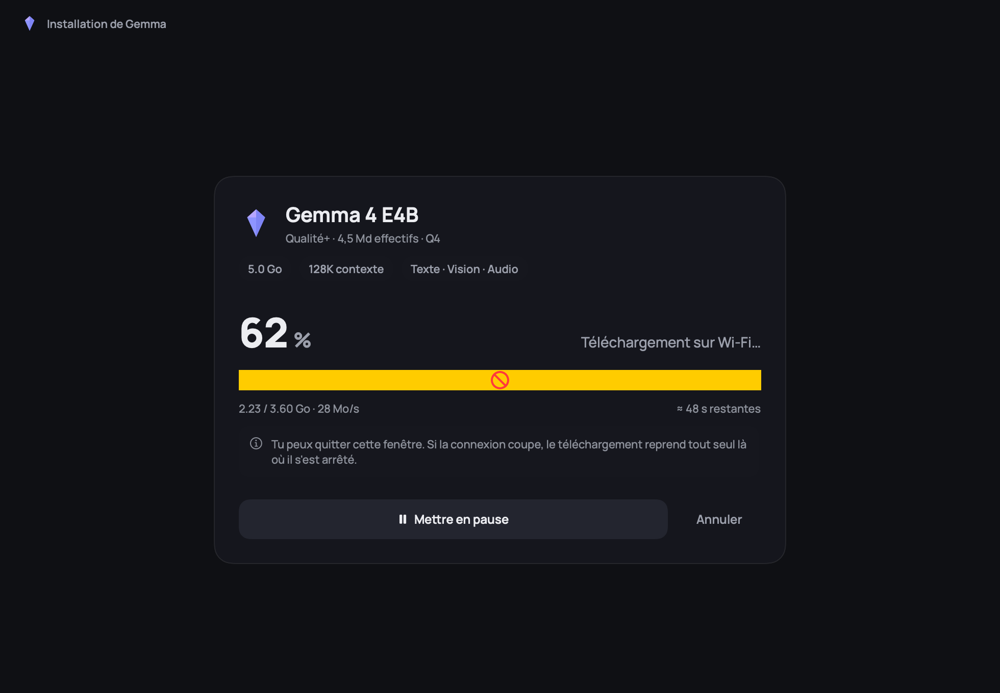
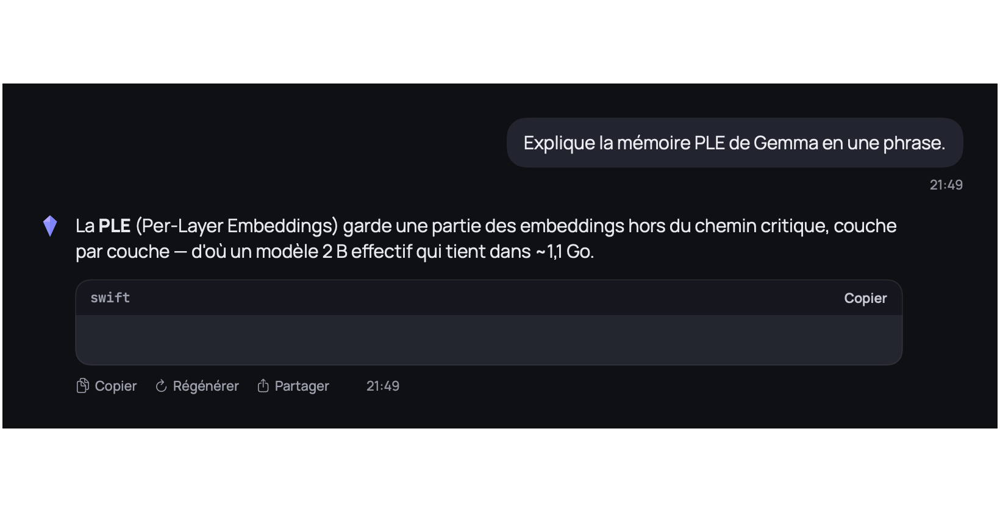

<div align="center">



# GemmaChat — macOS

**Un assistant IA qui tourne entièrement sur ton Mac. 100 % local, hors‑ligne, privé.**

Application macOS native (SwiftUI) de chat avec **Gemma 4**, inférence **MLX** sur Apple Silicon,
multimodale (texte · image · audio). Aucune donnée ne quitte la machine.

### [⬇️ Télécharger la dernière version (.dmg)](https://github.com/Gaetan-PRUVOT-SQS/Gemma-Chat-Mac-Os/releases/latest)

macOS 15+ · Apple Silicon (M1+) · 16 Go RAM conseillés
*App non notarisée : au 1er lancement, **clic droit → Ouvrir**. ([détails](https://github.com/Gaetan-PRUVOT-SQS/Gemma-Chat-Mac-Os/releases/latest))*

</div>

---

## ✨ Fonctionnalités

- 💬 **Chat en streaming** avec rendu **Markdown** maison (gras/italique, code avec bouton copier, titres, listes) et nettoyage **LaTeX/maths** → Unicode (CO₂, x²…).
- 🖼️ **Multimodal** : analyse d'image et **audio** (enregistrement WAV 16 kHz mono).
- 🧠 **Modèles Gemma 4 E2B / E4B** (MLX 4‑bit), bascule à chaud depuis l'en‑tête.
- 🗂️ **Conversations** multiples persistées, recherche, regroupées par date.
- ⚙️ **Réglages** : température, tokens max, vider le cache.
- 📥 **Téléchargement du modèle** au premier lancement (reprise auto, pause/annuler).
- 🔒 **100 % hors‑ligne** — exécution sur **GPU Metal** (Apple Silicon), rien n'est envoyé en ligne.
- ⌨️ Raccourcis (`⌘N`, `⌘K`, `⌘↵`), actions message **Copier · Régénérer · Partager**.

## 📸 Aperçu

| Accueil + scan | Téléchargement | Chat |
|---|---|---|
|  |  |  |

## 🚀 Build & run

**Prérequis** : macOS 15+, Apple Silicon (M1+), **Xcode 16+** (avec le Metal Toolchain),
[`xcodegen`](https://github.com/yonaskolb/XcodeGen) (`brew install xcodegen`).

```bash
# 1. Générer le projet Xcode depuis project.yml
xcodegen generate

# 2. Construire (xcodebuild — requis pour les shaders Metal de MLX)
export DEVELOPER_DIR=/Applications/Xcode.app/Contents/Developer
xcodebuild build -project GemmaChat.xcodeproj -scheme GemmaChat \
  -destination 'platform=macOS' -skipMacroValidation

# (au besoin, une seule fois) composant Metal d'Xcode 26 :
# xcodebuild -downloadComponent MetalToolchain
```

Ou ouvre `GemmaChat.xcodeproj` dans Xcode et lance ▶︎. Au **premier lancement**, l'app télécharge
le modèle (~3,6 Go pour E2B, ~5 Go pour E4B). RAM conseillée : **16 Go**.

### Tests

```bash
xcodebuild test -project GemmaChat.xcodeproj -scheme GemmaChatTests \
  -destination 'platform=macOS' -skipMacroValidation     # tests unitaires (préprocesseur maths)
GemmaChat.app/Contents/MacOS/GemmaChat --qa              # tests fonctionnels (persistance, markdown)
GemmaChat.app/Contents/MacOS/GemmaChat --probe           # inférence réelle (texte/image/audio)
```

## 🧱 Architecture

SwiftUI + MLX via le package [`gemma-4-swift-mlx`](https://github.com/VincentGourbin/gemma-4-swift-mlx)
(qui tire `mlx-swift` / `mlx-swift-lm`).

```
GemmaChat/
├─ Inference/   GemmaEngine (texte via ChatSession, image+audio via injection manuelle),
│               DeviceScan (scan de compatibilité), ModelCatalog
├─ Persistence/ ConversationStore (JSON), Preferences (UserDefaults)
├─ Audio/       WavRecorder (WAV 16 kHz mono)
├─ ViewModel/   ChatViewModel, Models
├─ Views/       Welcome, Download, Chat, Sidebar, Settings, Markdown (rendu + maths)
└─ Theme/       Couleurs, typographie (polices Manrope / JetBrains Mono bundlées)
```

Détails techniques et audit qualité : voir [`PROJECT_STATE.md`](PROJECT_STATE.md) et [`QA_AUDIT.md`](QA_AUDIT.md).

> **Pourquoi E2B/E4B et pas le 12B ?** L'architecture `gemma4` 12B « unifié » n'est pas encore
> supportée en Swift/MLX ; E2B/E4B offrent le multimodal complet (texte + image + audio) en natif.

## 📄 Licence

Code sous licence **Apache 2.0** (voir [`LICENSE`](LICENSE)). L'usage du modèle **Gemma** est soumis
aux [Gemma Terms of Use](https://ai.google.dev/gemma/terms) de Google.
